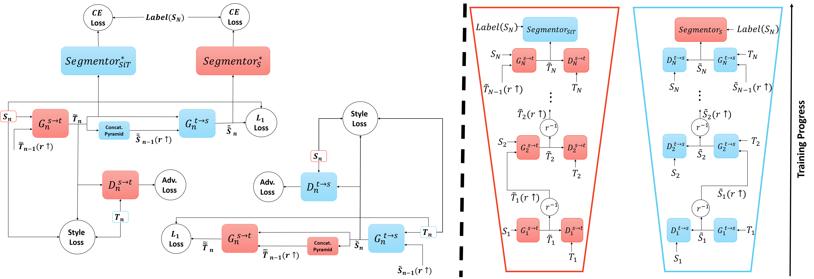
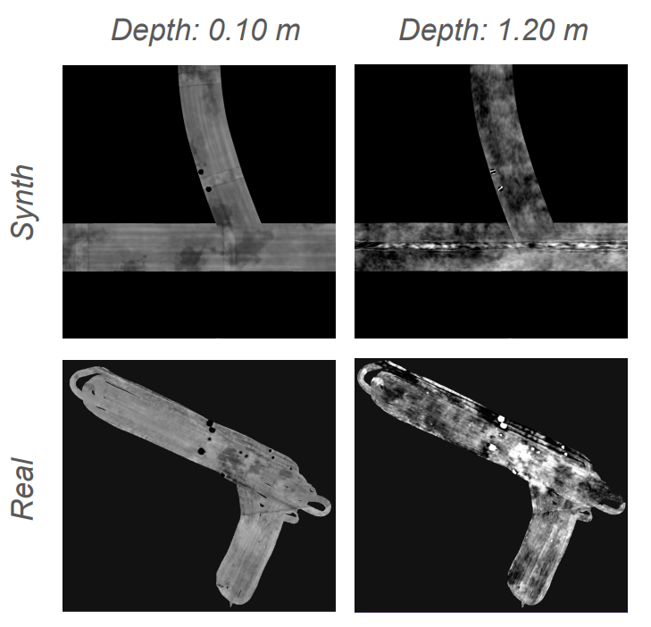
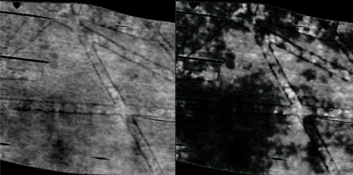
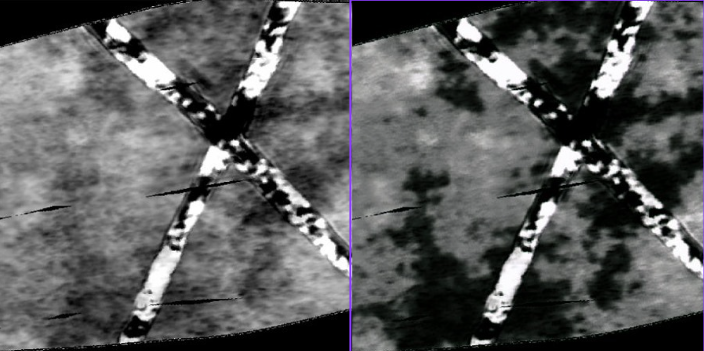

# ProCST: Boosting Semantic Segmentation Using Progressive Cyclic Style-Transfer for GPR Data

The architecture of the ProCST is shown below:



In this thesis, we propose a **novel two-stage framework** for improving Unsupervised Domain Adaptation (UDA) techniques applied to Ground Penetrating Radar (GPR) data. 

The first step involves progressively training a multi-scale neural network to transfer synthetic GPR data to resemble real-world GPR data. We denote this transformed data as **"Source in Target" (SiT).**

The SiT data is then used as input to standard UDA approaches. By reducing the domain gap between synthetic and real-world GPR data, the UDA approach can **further close the gap** and enhance performance.

We demonstrate the improvement achieved by our framework using the DAFormer model combined with ProCST, showcasing its effectiveness on synthetic-to-real GPR data.

## Setup Environment And Datasets

### Environment

Ensure you have Python version >= 3.8. Set up a new virtual environment:

```bash
python -m venv ~/venv/procst\source ~/venv/procst/bin/activate
```

Clone the repository and install requirements:

```bash
git clone https://github.com/DavidDelange/ProCST
cd ProCST
pip install -r requirements_seescans.txt -f https://download.pytorch.org/whl/torch_stable.html
```

### Download Pretrained Networks

Download the pretrained segmentation networks trained on synthetic GPR data. Create a `./pretrained` folder and save the pretrained networks there.

1. [Synthetic GPR pretrained segmentation net](https://your-link.com/pretrained_gpr_synthetic)

### Setup Datasets

Set up your GPR dataset (ours is private)

The final folder structure should look like this:

```bash
ProCST-GPR
├── ...
├── data
│   ├── synth
│   │   ├── train 
│   │   
│   ├── real
│   │   ├── train
│   │   ├── valid
├── pretrained
│   ├── pretrained_semseg_on_synthetic.pth
│  
├── ...
```

## Train ProCST Model

To train the model, use one NVIDIA A6000 GPU or a similar GPU setup.

#### Synthetic GPR &rarr; Real GPR:

```bash
python ./train_procst.py --batch_size_list 64 16 4 --gpus gpu_id
```

## Generate SiT Datasets (Synthetic GPR &rarr; Real GPR)

After training the ProCST model, you can generate the **Source in Target (SiT)** dataset, which translates synthetic GPR data to match the style of real-world GPR data.

```bash
python ./create_sit_dataset.py --batch_size=1 --trained_procst_path=path/to/pretrained_procst --sit_output_path=path/to/save/output_images --gpus gpu_id
```

After generating the SiT dataset, replace the original source images with the resulting SiT images for further UDA training. The segmentation maps remain unchanged due to ProCST's content preservation properties.

## Example Visual Comparisons

Below are visual examples that illustrate the effectiveness of our approach:

### Synthetic vs. Real Data Example



This figure shows a comparison between synthetic GPR data and real GPR data, highlighting the differences in visual characteristics that the model aims to bridge.

### Transformed Synthetic Data Example




These figures demonstrate the synthetic data after transformation using ProCST, showing how the style of synthetic data is adapted to match the real data, while preserving critical structural features.
